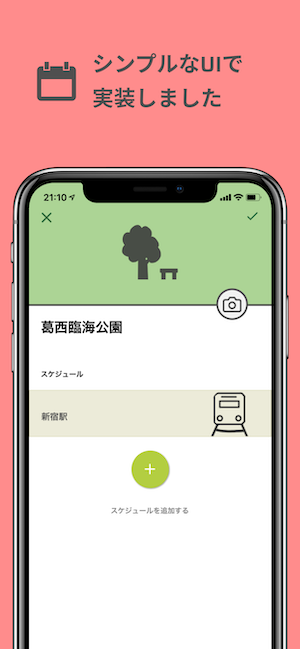
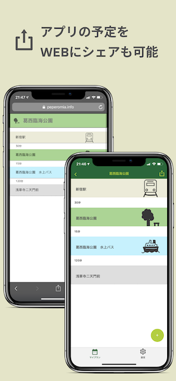

# ペペロミア

[](https://github.com/wheatandcat/Peperomia/actions)
[](https://github.com/wheatandcat/Peperomia/actions)
[](https://github.com/wheatandcat/Peperomia/actions)
[](https://codecov.io/gh/wheatandcat/Peperomia)

<div style="display:flex">
    
    
    
    
    
</div>

ペペロミアは予定作成アプリです

## パッケージ
 - Expo SDK 39
 - TypeScript v3.9
 - react-navigation v5

## expo

https://expo.io/@wheatandcat/peperomia


# リンク

## 公式Webサイト
https://peperomia.app

## 制作ブログ
http://wheatandcat.hatenablog.com/

## Apple Store
https://itunes.apple.com/us/app/%E3%83%9A%E3%83%9A%E3%83%AD%E3%83%9F%E3%82%A2/id1460583871?l=ja#?platform=iphone

## Google Play Store
https://play.google.com/store/apps/details?id=com.wheatandcat.peperomia


## 他リポジトリ
 - [バックエンド(PeperomiaBackend)](https://github.com/wheatandcat/PeperomiaBackend)
 - [Web版(PeperomiaWeb)](https://github.com/wheatandcat/PeperomiaWeb)
 - [ヘルプサイト(PeperomiaHelp)](https://github.com/wheatandcat/PeperomiaHelp)
 - [ツール系(PeperomiaTool)](https://github.com/wheatandcat/PeperomiaTool)
 - [LPサイト(PeperomiaWebSite)](https://github.com/wheatandcat/PeperomiaWebSite)

## ローカルでの実行手順

取り敢えず、ローカル環境を作りたい人は以下のコマンドで初期設定が済むようになっています。

```
$ brew install jq
$ sh localInit.sh
yes
```

## Firebaseのアカウントを持っている場合
①. 「.env.template」の下記の値に自身のFirebaseの情報を追記

```
FIRE_BASE_API_KEY=""
FIRE_BASE_AUTH_DOMAIN=""
FIRE_BASE_DATABASE_URL=""
FIRE_BASE_PROJECT_ID=""
FIRE_BASE_STORAGE_BUCKET=""
FIRE_BASE_MESSAGING_SENDER_ID=""
```

②.「.env.template」を「.env」にリネーム
③.「yarn start」で起動させる

## Firebaseのアカウントを持っていない場合
①. 「.env.template」を「.env」にリネーム
②. 「src/lib/firebase.ts」の下記をコメントアウト

```
// firebase.initializeApp(firebaseConfig);
// const db = firebase.firestore();
```
③.「yarn start」で起動させる

# ローカル実行

```
$ yarn start
```

# テスト

```
$ yarn test
```

## テスト指定

```
$ yarn test yarn test --findRelatedTests src/components/pages/Calendar/__tests__/index.test.tsx
```

## カバレッジ

```
$ yarn test:coverage
$ open ./coverage/lcov-report/index.html
```

# build

## ios

```
$ yarn build:ios
```

## android


```
$ yarn build:android
```

# テストコード生成

```
$ yarn hygen testCode new
```

# e2e

## 初回
https://expo.io/tools#client
↑iOSのアプリファイルをMacにダウンロード

ダウンロードしたフォルダを解答して「Exponent.app」にrenameする。
このプロジェクトの直下に「bin」フォルダを生成して「Exponent.app」を配置する


## テスト実行

```
$ yarn start
$ yarn e2e
```


# storybook 

```
$ yarn storybook 
$ yarn storybook-server
```


## storybook deploy 

```
$ yarn storybook:copy
$ expo-cli publish --config storybook/app.json
```

## React Native Debugger

### 初期設定

```
$ open "rndebugger://set-debugger-loc?host=localhost&port=19001"
```

