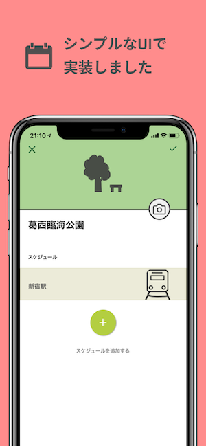

# ペペロミア

    
    
    
    
    

ペペロミアは予定作成アプリです

## パッケージ
 - Expo SDK 37
 - TypeScript v3.8
 - react-navigation v5

## expo

https://expo.io/@wheatandcat/peperomia

# リンク

## 公式Webサイト
https://peperomia.app

## 制作ブログ
http://wheatandcat.hatenablog.com/

## Apple Store
https://itunes.apple.com/us/app/%E3%83%9A%E3%83%9A%E3%83%AD%E3%83%9F%E3%82%A2/id1460583871?l=ja#?platform=iphone

## Google Play Store
https://play.google.com/store/apps/details?id=com.wheatandcat.peperomia

## 他リポジトリ
 - [バックエンド(PeperomiaBackend)](https://github.com/wheatandcat/PeperomiaBackend)