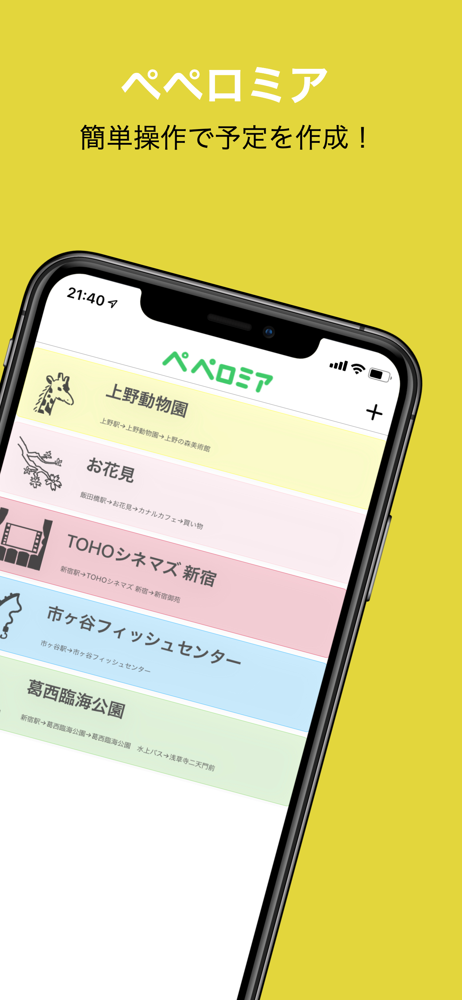
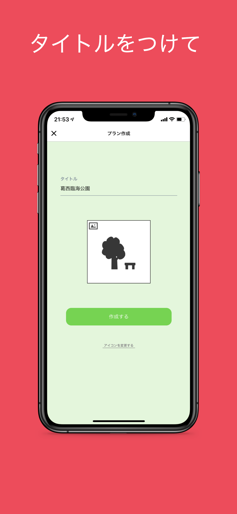
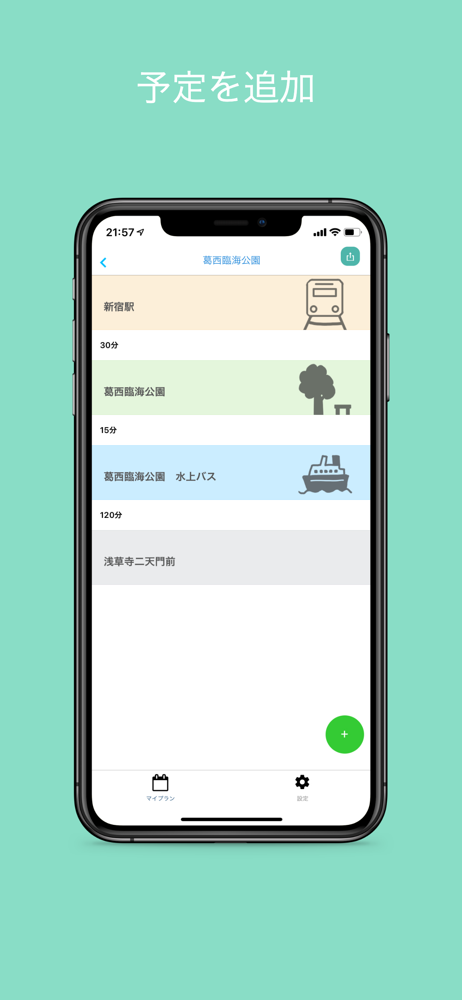
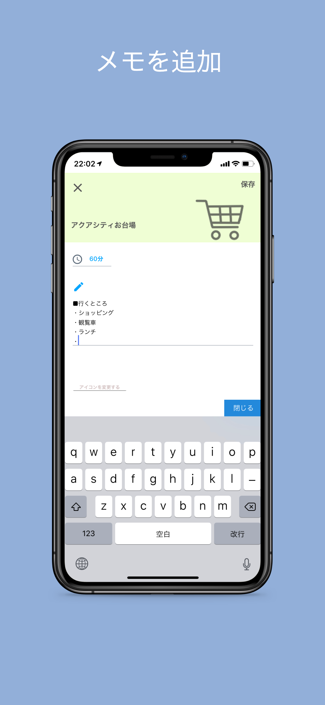

# ペペロミア

<div style="display:flex">
    
    
    
    
</div>

ペペロミアは予定作成アプリです

## expo

https://expo.io/@wheatandcat/peperomia

## storybook publish

```
expo-cli publish --config storybook/app.json
```

## test

```
npm run test
```
